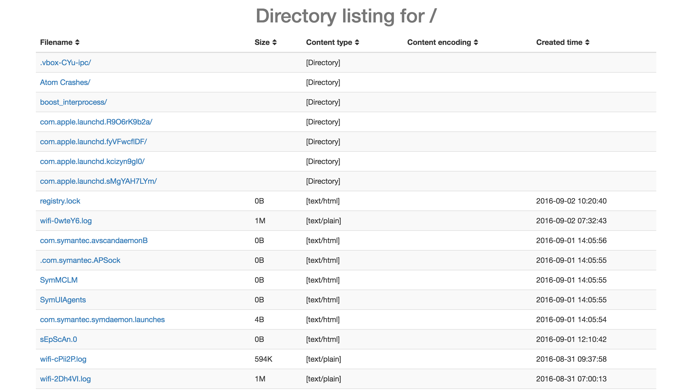

# twisted-customise-file-server
Enhance the twisted static file server with customised contents (e.g. add content of file create time) and html page (e.g. use [bootstrap](http://getbootstrap.com/) in the web page).

Here is an example of web integrated with bootstrap and also added a column for the file's created time:



### Implenmented

- Can render html file outside instead of using python string
- The outside html file can import local static files (css, js .etc)

### How to use

#### Start web server in python code

```python
from customise_server import CustomiseServer

if __name__ == '__main__':
    server = CustomiseServer('/tmp')
    server.run()
```

This will block the main process until you stop the web server.

#### Start web server by cmdline


### Settings

I move the hard coded variables to the `settings.py` file. Just look at this file and change the content if necessary.

## TODO List

- Can easily choose what contents are displayed in the table of the web (e.g. only display file name and its created time)
- A simple cmdline to start a static file server